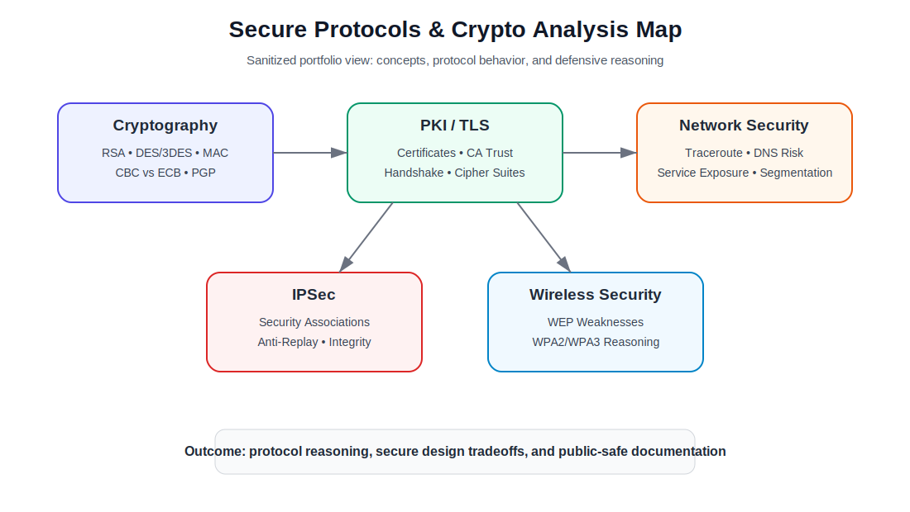
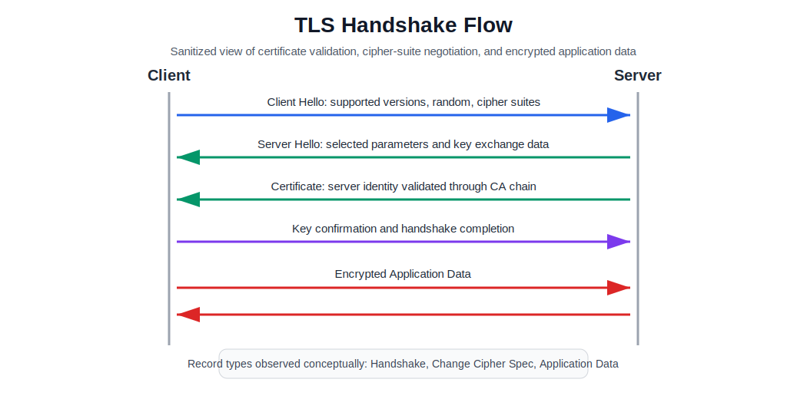

# Secure Protocols & Crypto Analysis

A sanitized security foundations portfolio project covering cryptography, PKI, TLS, IPSec, wireless security, and network protocol analysis.

> **Disclaimer:** This is an academic/portfolio case study. It does not contain private keys, credentials, student identifiers, raw packet captures, internal network data, home Wi-Fi screenshots, or unredacted coursework pages. Any examples are generalized for public GitHub presentation.

## What This Project Demonstrates

- Cryptography fundamentals: encoding, symmetric/asymmetric encryption, RSA, DES/3DES, block cipher modes, and MACs
- PKI and certificate analysis: certificate chains, CAs, CRLs, digital signatures, public keys, and browser trust
- TLS workflow analysis: Client Hello, Server Hello, Change Cipher Spec, Application Data, cipher-suite negotiation, and session randomness
- IPSec protocol reasoning: Security Associations, anti-replay windows, network-layer transparency, and Encrypt-then-MAC
- Network security analysis: traceroute interpretation, DNS reflection risk, service-discovery reasoning, and switched-LAN attack defenses
- Wireless security reasoning: WEP weaknesses, WPA2/WPA3 migration logic, and authentication risks
- Public-safe technical documentation and evidence curation

## Repository Structure

```text
.
├── README.md
├── docs/
│   ├── executive-summary.md
│   ├── cryptography-foundations.md
│   ├── pki-tls-analysis.md
│   ├── network-protocol-analysis.md
│   ├── ipsec-wireless-security.md
│   ├── lab-evidence-map.md
│   ├── screenshot-guide.md
│   └── redaction-and-publication-checklist.md
├── data/
│   ├── concept-matrix.csv
│   └── protocol-observations.csv
└── assets/
    ├── diagrams/
    │   ├── crypto-protocol-map.svg
    │   └── tls-handshake-flow.svg
    └── screenshots/
        └── README.md
```

## Quick Portfolio Narrative

This project consolidates academic and lab-based security analysis into a recruiter-friendly secure-protocols portfolio. It focuses on explaining how cryptographic systems and network security protocols work, where they fail, and how defenders reason about secure implementation.

The repository is intentionally curated. It does **not** publish raw homework PDFs, raw screenshots, public-key blocks, packet captures, personal identifiers, or real network details. Instead, it presents sanitized summaries, protocol maps, defensive observations, and safe diagrams.

## Portfolio Artifacts

| Artifact | Purpose |
|---|---|
| [`docs/executive-summary.md`](docs/executive-summary.md) | Business/technical summary of the secure protocols analysis work. |
| [`docs/cryptography-foundations.md`](docs/cryptography-foundations.md) | Curated notes on encodings, classical ciphers, RSA, DES/3DES, CBC/ECB, MACs, and PGP. |
| [`docs/pki-tls-analysis.md`](docs/pki-tls-analysis.md) | Certificate-chain and TLS-handshake analysis in public-safe form. |
| [`docs/network-protocol-analysis.md`](docs/network-protocol-analysis.md) | Traceroute, DNS reflection, scanning hygiene, and LAN security reasoning. |
| [`docs/ipsec-wireless-security.md`](docs/ipsec-wireless-security.md) | IPSec, Diffie-Hellman authentication, Encrypt-then-MAC, WEP, and wireless security notes. |
| [`docs/lab-evidence-map.md`](docs/lab-evidence-map.md) | Maps source work to public-safe portfolio evidence. |
| [`docs/screenshot-guide.md`](docs/screenshot-guide.md) | Explains which images are safe to use and where to place them. |
| [`docs/redaction-and-publication-checklist.md`](docs/redaction-and-publication-checklist.md) | Prevents accidental exposure of personal, academic, or network-sensitive details. |

## Protocol Map



## TLS Handshake Flow



## Main Topic Areas

| Area | What It Shows |
|---|---|
| Cryptography basics | Ability to reason about confidentiality, integrity, authentication, and non-repudiation. |
| PKI / certificates | Understanding of certificate chains, CAs, CRL checks, RSA keys, and browser trust. |
| TLS | Ability to interpret handshake content types, cipher suites, random values, and encrypted application data. |
| IPSec | Understanding of network-layer protection, anti-replay windows, and Security Associations. |
| Network security | Ability to interpret route behavior, service-discovery output, and defensive controls. |
| Wireless security | Understanding of WEP weaknesses and why modern wireless protections are needed. |

## Skills Demonstrated

`Cryptography` `PKI` `TLS` `Wireshark` `IPSec` `RSA` `PGP` `Certificates` `Network Security` `Wireless Security` `Protocol Analysis` `Security Documentation`

## How I Would Explain This in an Interview

> I converted academic cryptography and network-security work into a public-safe portfolio project. I analyzed cryptographic primitives, certificate trust, TLS handshake behavior, IPSec protections, and network-security scenarios, then documented the material as sanitized protocol analysis rather than uploading raw assignments or sensitive screenshots.
