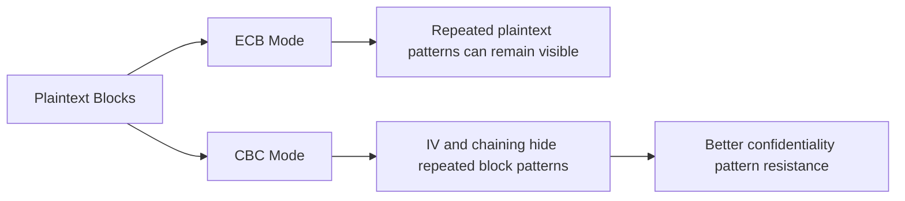

# Cryptography Foundations

This document summarizes the cryptography concepts demonstrated across the source work. It is written as a curated portfolio artifact instead of a raw homework upload.

## Concept Matrix

| Concept | Security Property | Key Learning |
|---|---|---|
| Base64 / Base58 / Hex | Representation | Encoding changes data format but does not provide secrecy. |
| Caesar / Vigenere / Rail Fence | Historical confidentiality | Classical ciphers demonstrate substitution and transposition but are not secure for modern use. |
| XOR | Symmetric operation | XOR is reversible and is useful for understanding how key material combines with data. |
| RSA | Asymmetric encryption/signing | Public/private key pairs support confidentiality and digital signatures when used safely. |
| Textbook RSA | Learning primitive | Deterministic encryption leaks patterns; real systems require safe padding and protocol design. |
| DES / 3DES | Symmetric block encryption | Security analysis must consider practical shortcuts, not just theoretical key length. |
| ECB vs CBC | Block cipher mode behavior | ECB leaks repeated structure; CBC improves pattern hiding with chaining and IVs. |
| MAC / HMAC / CBC-MAC | Integrity and authentication | A MAC proves knowledge of a shared secret but does not provide non-repudiation. |
| Digital Signature | Authentication and attribution | A signature uses asymmetric keys so a verifier can attribute signing to the private-key holder. |
| PGP | Secure email workflow | Signing, compression, and encryption combine different security goals. |

## RSA Summary

Textbook RSA follows three basic functions:

1. **Key generation**: choose primes `p` and `q`, compute `n = p*q`, compute `phi(n) = (p-1)(q-1)`, choose public exponent `e`, and compute private exponent `d` as the modular inverse of `e`.
2. **Encryption**: compute `c = m^e mod n` with the public key.
3. **Decryption**: compute `m = c^d mod n` with the private key.

Portfolio takeaway: textbook RSA is useful for learning modular arithmetic, but real systems require padding, careful key management, and protocol-level protections.

## Block Cipher Mode Lesson

## MAC vs Signature

| Mechanism | Key Type | Integrity | Authentication | Non-Repudiation |
|---|---|---:|---:|---:|
| MAC | Shared symmetric key | Yes | Yes, between shared-key holders | No |
| Digital signature | Private/public key pair | Yes | Yes | Yes, when the private key is protected |

## Public-Safe Notes

Do not publish raw decrypted challenge strings, public-key blocks, full assignment answers, fingerprints, or long key material. Summarize the concept and security lesson instead.
