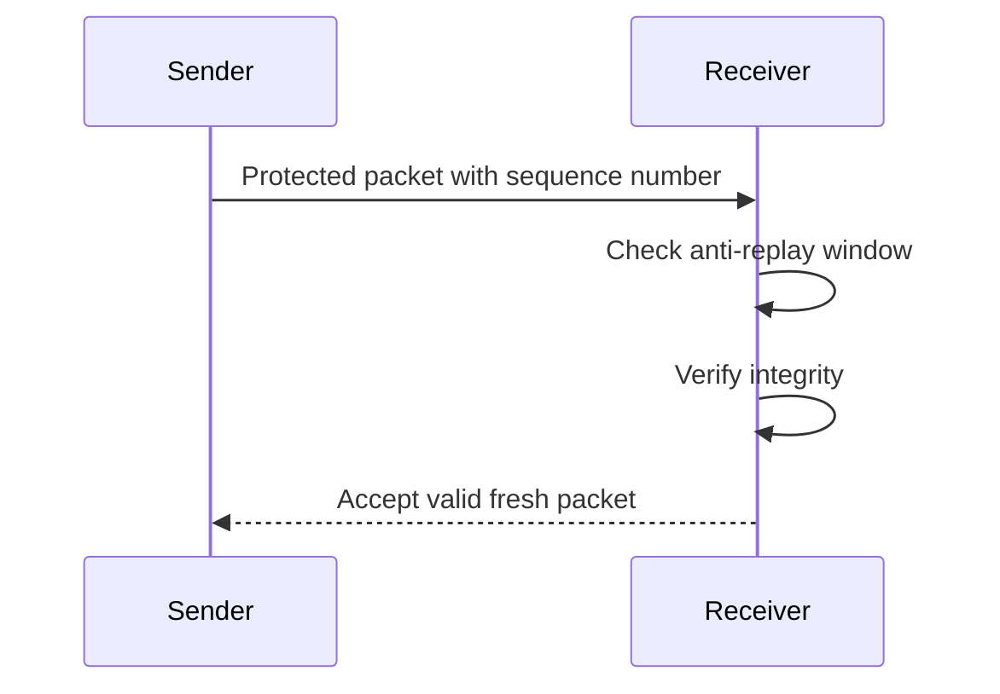
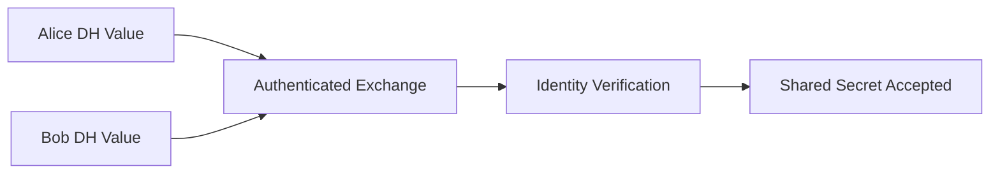

# IPSec and Wireless Security

This document summarizes IPSec, secure composition, Diffie-Hellman authentication, and wireless security lessons in public-safe form.

## IPSec Anti-Replay Protection

IPSec uses sequence numbers and an anti-replay window. Each Security Association maintains packet ordering state, and the receiver accepts only fresh packets within the expected window after integrity verification.

## Security Associations

| Concept | Explanation |
|---|---|
| Security Association | A one-way logical relationship defining how traffic is protected. |
| Two-way communication | Requires separate inbound and outbound SAs. |
| Security Association Database | Stores active SAs and their parameters. |
| Application transparency | IPSec works at the network layer, so applications usually do not need code changes. |

## Encrypt-then-MAC Lesson

| Construction | Summary |
|---|---|
| Encrypt-then-MAC | Encrypt data first, authenticate the ciphertext, then decrypt only if verification succeeds. |
| MAC-then-Encrypt | Compute MAC over plaintext and then encrypt; older designs can be harder to validate safely. |
| AEAD | Modern approach combining confidentiality and integrity in one construction. |

## Diffie-Hellman Authentication Lesson

Diffie-Hellman establishes a shared secret across an insecure channel, but the basic exchange does not prove identity. The secure design lesson is to combine the exchange with authentication, such as certificates or digital signatures.

## Wireless Security Notes

| Protocol / Concept | Security Lesson |
|---|---|
| WEP | Obsolete due to weak IV handling, RC4 issues, and weak integrity. |
| WPA2 | Stronger modern baseline for personal networks when configured safely. |
| WPA3 | Improved authentication model for newer networks. |
| Challenge-response | Must be designed so reusable verification material is not exposed. |
| Home Wi-Fi screenshots | Do not publish if they show SSID, MAC address, IP address, or location metadata. |

## Interview Talking Point

> I analyzed how IPSec uses sequence numbers and anti-replay windows, why secure composition matters, how Diffie-Hellman should be authenticated, and why modern wireless protocols replaced WEP. The focus was on protocol reasoning and defensive interpretation.
