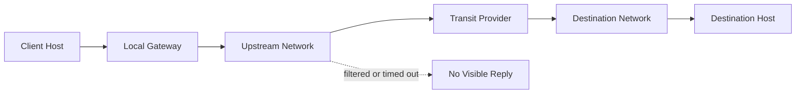

# Network Protocol Analysis

This document summarizes network-security concepts from the source work in a public-safe way. It avoids raw IP ranges, public scans, home network details, and unredacted command screenshots.

## Topic Summary

| Topic | What Was Analyzed | Defensive Lesson |
|---|---|---|
| Traceroute | Hop-by-hop route behavior and timeout interpretation | Missing hops can indicate filtering, rate limiting, firewall behavior, or non-responsive routers. |
| WHOIS / Registry Lookup | Domain and network ownership information | Public registry data can support OSINT, asset inventory, and attribution checks. |
| Service Discovery | Identification of services and versions on controlled lab hosts | Scanning should be scoped, authorized, and rate-limited to avoid disruption. |
| DNS Reflection | Reflection and amplification risk in DNS infrastructure | Secure resolvers, rate limiting, and source validation reduce exposure. |
| Switched-LAN Security | Why switches reduce passive visibility but do not solve every risk | Use dynamic ARP inspection, port security, VLAN isolation, and encryption. |
| TCP / Spoofing Limits | Why stateful TCP handshakes make spoofed-session establishment difficult | Protocol state and acknowledgements provide practical barriers to simple spoofing. |

## Traceroute Interpretation

Traceroute is useful because it reveals the path packets take toward a destination. A responding hop usually shows router identity and round-trip timing. A non-responding hop does not automatically mean the path failed; it may mean the device blocks or rate-limits diagnostic responses.

## Service Discovery Hygiene

Public-safe rule: describe the method and lesson, not raw targets.

Good portfolio wording:

> Performed authorized service-discovery analysis in a controlled lab environment to identify exposed services and reason about network segmentation, service exposure, and defensive monitoring.

Avoid publishing:

- real IP addresses or subnets;
- full scan output;
- university or cyber-range hostnames;
- commands that point at real networks;
- screenshots showing account names or VM prompts.

## DNS Reflection Risk

A DNS reflection scenario highlights how small spoofed queries can produce larger responses from open resolvers. The defensive takeaway is to prevent resolver abuse and reduce amplification exposure.

Defensive controls:

- restrict recursive DNS to trusted clients;
- apply rate limits;
- monitor unusual query volume;
- use source-address validation where possible;
- avoid exposing unnecessary DNS services.

## Switched-LAN Defensive Controls

| Risk Area | Defensive Control |
|---|---|
| ARP trust issues | Dynamic ARP inspection and DHCP snooping |
| Excessive MAC learning | Port security and switch monitoring |
| Flat network exposure | VLAN segmentation |
| Plaintext protocols | Encrypted protocols and certificate-based trust |
| Weak monitoring | IDS/IPS and SIEM alerting on unusual local traffic |

## Interview Talking Point

> I used network protocol exercises to reason about how traffic moves, why diagnostic tools can be incomplete, how service exposure should be scoped, and how defenders reduce protocol abuse through segmentation, rate limiting, resolver hardening, and encrypted communication.
