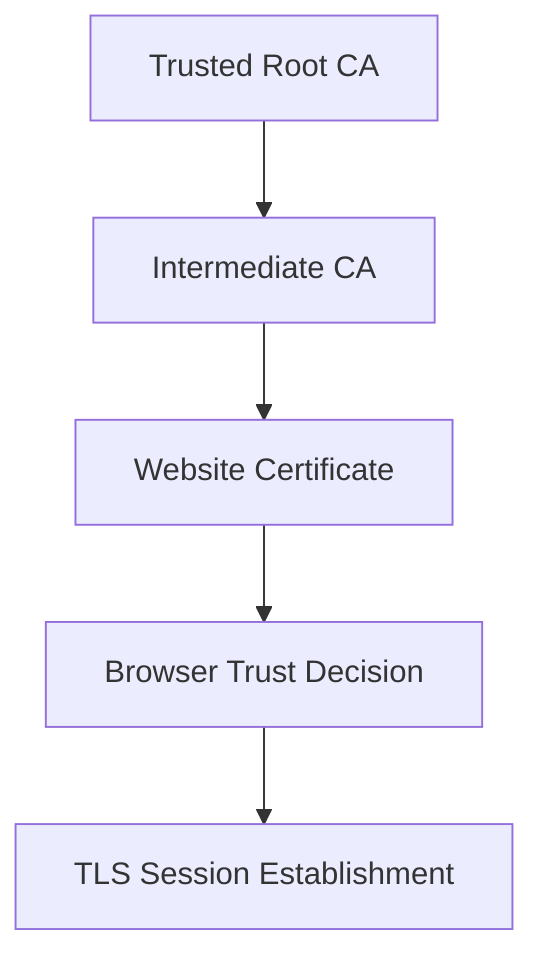

# PKI and TLS Analysis

This document summarizes public-safe certificate and TLS handshake analysis from the source work.

## PKI Analysis

The certificate analysis focused on how a browser evaluates a public website certificate. The important components were:

| Component | What It Shows |
|---|---|
| Subject / Common Name | The domain or entity the certificate represents. |
| Issuer | The certificate authority or intermediate CA that signed the certificate. |
| Chain of Trust | The path from the end-entity certificate to an intermediate CA and trusted root CA. |
| Validity Period | The time window during which the certificate is valid. |
| CRL Distribution Points | Locations where revocation status information can be checked. |
| Signature Algorithm | The cryptographic method used by the CA to sign the certificate. |
| Public Key | The public component used for authentication and secure key exchange. |

## Certificate Chain Model



## TLS Handshake Concepts

| TLS Item | Public-Safe Explanation |
|---|---|
| Client Hello | Starts the TLS negotiation and advertises supported protocol options. |
| Server Hello | Selects the protocol parameters and confirms the negotiated direction. |
| Certificate | Allows the client to verify the server identity through PKI. |
| Cipher Suite | Defines encryption, authentication, and integrity algorithms for the session. |
| Change Cipher Spec | Indicates transition to protected communication in older TLS flows. |
| Application Data | Encrypted payload after secure session establishment. |
| Client Random / Server Random | Random values used as part of session key derivation. |

## Observed TLS Record Types

| Content Type | Meaning |
|---:|---|
| 20 | Change Cipher Spec |
| 22 | Handshake |
| 23 | Application Data |

## TLS 1.3 Portfolio Takeaway

Modern TLS uses ephemeral key exchange, such as ECDHE, so the premaster or traffic secret is not transmitted directly in the packet capture. Without session key logs or endpoint secrets, encrypted application data remains protected.

## Screenshot Guidance

Safe image candidate:

```text
assets/screenshots/01-tls-certificate-chain.png
assets/screenshots/02-tls-handshake-record-types.png
```

Use only cropped and redacted screenshots. Avoid uploading full browser windows, raw packet captures, long public key modulus values, serial numbers, or screenshots that expose personal/course metadata.
